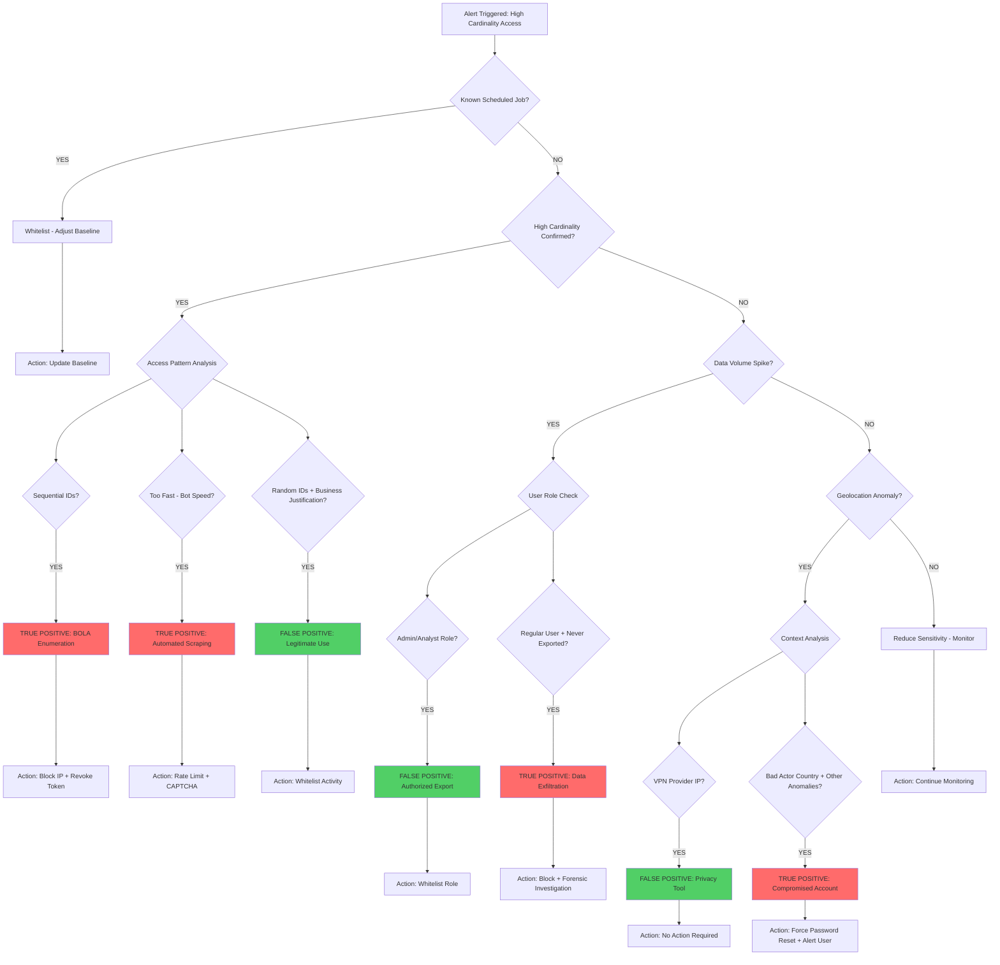

# True Positive vs False Positive Triage Flowchart

**Key Decision Points:**

1. **Scheduled Job Check** (Easiest FP to eliminate)
2. **Pattern Analysis** (Sequential = High confidence TP)
3. **Speed Analysis** (Bot-speed = Automation)
4. **Role Verification** (Admin doing admin things = FP)
5. **Context** (VPN + Normal behavior = FP, VPN + Anomalies = TP)

---

*Created: February 1, 2026*  
*Use: Interview whiteboarding exercise*
